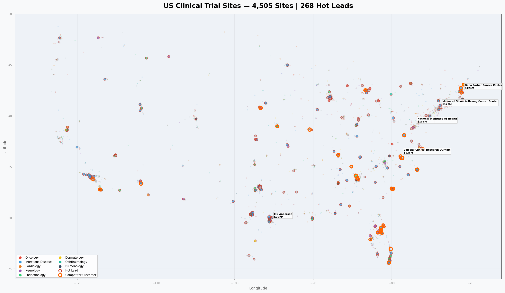
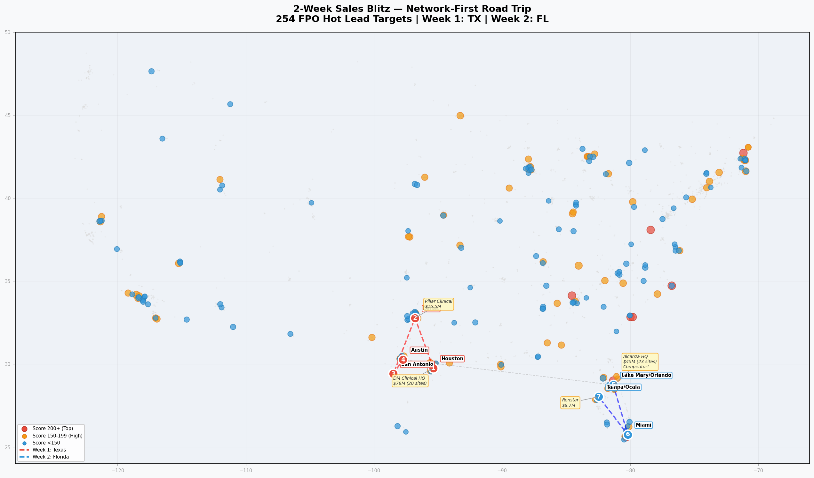
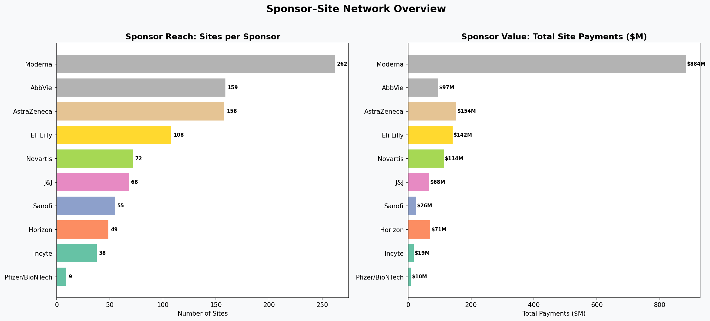

# Delfa AI — 2-Week Sales Road Trip Strategy

---

## The Numbers

| | |
|---|---|
| **4,551** | US clinical trial sites analyzed |
| **482** | curated hot leads |
| **254** | FPO targets scored & ranked |
| **$165M** | addressable in 2 weeks (TX + FL) |

---

## The Challenge

Plan a 2-week in-person road trip to close maximum deals for Delfa AI's patient recruitment management system.

**What we had:**
- **Dataset A** — 4,551 US sites with 2024 sponsor payments
- **Dataset B** — 482 hot leads with contacts and competitor intel
- 17 existing Delfa customers (use as reference accounts)
- 13 competitor customers (warmest leads — already pay for recruitment tools)

**Key filter:** Target **FPOs** (independent sites, fast decisions, need recruitment help). Skip **NPOs** (academic centers with internal recruitment and 6-12 month procurement).

---

## How We Scored Targets

| Factor | Points | Why |
|--------|--------|-----|
| Hot lead (curated list) | **+100** | Already vetted for product-fit |
| Competitor customer (Alleviate/Grove) | **+50** | Already pays for recruitment tools |
| Revenue $5M+ | +40 | High trial volume = acute recruitment need |
| Revenue $1M–$5M | +25 | Has budget, lacks internal tools |
| Has contact info (email/LinkedIn) | +30 | Can pre-book meetings before arriving |
| FPO status | +20 | Fast decision-makers |
| High-volume therapeutic area | +10 | Infectious Disease, Oncology = most patients needed |

**Result:** 254 FPO hot lead targets scored, ranked, and mapped.

---

## US Clinical Trial Landscape

4,505 sites colored by therapeutic area, sized by 2024 sponsor payments. Hot leads highlighted.

---

## The Network-First Insight

This changed everything. Many hot leads belong to **multi-site networks**. Close 2–3 HQs, unlock 40+ sites.

| Network | Sites | Payments | HQ | Strategic Value |
|---------|-------|----------|----|-----------------|
| **DM Clinical Research** | 20 | $79M | Houston, TX | 1 deal = 20 sites |
| **Alcanza Clinical** | 23 | $45M | Lake Mary, FL | Alleviate competitor customer |
| **AMR** | 16 | $43M | Knoxville, TN | Highest single-site ($34M) |
| **Alliance Clinical** | 15 | $35M | National | Hope Clinical $17M anchor |

**Instead of 94 individual meetings → 2–3 enterprise conversations that unlock 40+ sites.**

---

## The Recommendation

### Week 1: Texas — 53 targets, $118M

| Days | City | Key Meeting | Why |
|------|------|------------|-----|
| 1–2 | **Houston** | DM Clinical HQ ($79M, 20 sites) | 1 deal = 20 sites. Infectious Disease focus. |
| 3–4 | **Dallas** | Pillar Clinical ($15.5M) | Highest independent-site value in TX. Psychiatry niche. |
| 5–6 | **San Antonio** | Pinnacle Clinical ($2.8M, 8-site network) | Multi-state network anchor. |
| 7 | **Austin** | Hope Clinical + Alliance Network sites | Network hub + local independents. |

### Week 2: Florida — 41 targets, $47M

| Days | City | Key Meeting | Why |
|------|------|------------|-----|
| 8–9 | **Orlando/Lake Mary** | Alcanza HQ ($45M, 23 sites) | Alleviate competitor customer. Already budgets for recruitment tools. |
| 10–11 | **Miami** | Innovation Medical, Well Pharma | Test cross-specialty appeal. |
| 12–13 | **Tampa/Ocala** | Renstar/Phasewell ($8.7M, 2 sites) | Second-highest FL revenue outside Alcanza. |
| 14 | **Buffer** | Follow-ups, rescheduled meetings | Overflow day. |

---

## Road Trip Route

254 FPO hot lead targets with 7-stop route. Red = Week 1 (TX), Blue = Week 2 (FL).

---

## Top 5 Must-Win Targets

| # | Target | Payments | Why |
|---|--------|----------|-----|
| 1 | **DM Clinical Research** (TX) | $79M / 20 sites | Largest FPO network. 1 enterprise deal = 20 sites. |
| 2 | **Alcanza Clinical** (FL) | $45M / 23 sites | Competitor customer — already pays for recruitment tools. |
| 3 | **AMR Knoxville** (TN) | $34M single site | Highest single-site payments. Month 2 target. |
| 4 | **Hope Clinical** (CA) | $17M | Alliance Network hub (15 sites). Month 2 target. |
| 5 | **Pillar Clinical** (TX) | $15.5M | Dallas. Psychiatry niche. On Week 1 route. |

---

## Sponsor-Site Network

Top pharma sponsors decoded from trial protocol IDs — Moderna (263 sites), AbbVie (159), AstraZeneca (158), Eli Lilly (108), Novartis (72).

---

## What's Next

### Before the trip
- Email/LinkedIn outreach to 203 contacts with enriched data
- "I'll be in Houston visiting DM Clinical — would love 30 minutes"
- Research each target's current recruitment stack
- Prepare tailored demos for network HQs

### Month 2 trip
- Boston → NYC → Philly → Wilmington NC → Knoxville TN
- Captures $143M left on the table

### Key assumptions
- Revenue proxies trial volume, not recruitment need
- "Closing" = opening relationships (3–6 month sales cycle)
- Network HQs make centralized purchasing decisions
- Pre-trip outreach books confirmed meetings

### Risks
- DM Clinical declines meeting → TX week less efficient
- Alcanza locked into Alleviate contract → still worth the intel
- Contingency: swap TX Week 1 for Boston corridor

---

## How This Was Built

1. **Data processing** — Python (pandas, openpyxl) to clean, merge, and score 4,551 sites
2. **Geocoding** — pgeocode library for real zip-to-coordinate mapping (99% coverage)
3. **Maps** — Leaflet.js interactive HTML maps + matplotlib static PNGs
4. **Network analysis** — networkx for sponsor-site relationship mapping
5. **Protocol decoding** — Mapped trial protocol ID prefixes to pharma sponsors

All code, data, and interactive maps are in this repository.
